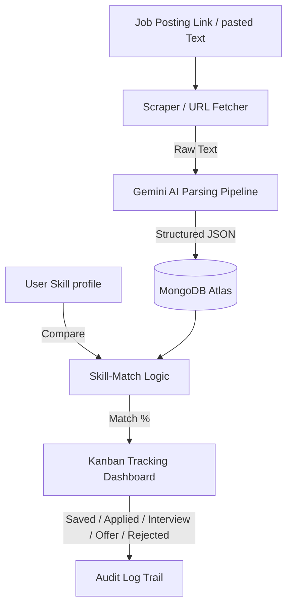

# 💼 Job Posting Aggregator & Auto-Apply Tracker

> **AI-Powered Agent for Structured Job Application Tracking & Match Analysis**

An automated dashboard that helps job seekers extract rich, structured metadata (role, company, required skills, location, salary, deadlines) directly from job URLs or pasted text using **Google Gemini**, compares requirements against their skill profile, and tracks progression in a single high-tech Kanban workflow.

---

## 🛑 The Problem

Tracking applications manually is tedious and fragmented:
- **Tab Overload**: Juggling tabs across LinkedIn, Indeed, Glassdoor, and individual company portals.
- **Lost Details**: Copy-pasting descriptions into spreadsheets that quickly get out-of-date.
- **Urgency Blindness**: Missing application deadlines or interview dates without visual cues.
- **Skill Mismatch**: Applying to jobs without knowing if your profile aligns with key required technologies.

**Our Solution**: One unified workspace that scrapes job postings, parses them instantly using AI, and presents status, deadline urgency, and skill-match rate on a visual Kanban interface.

---

## 🧬 System Architecture



---

## 🛠️ Tech Stack

| Component | Technology |
|---|---|
| **Frontend** | Next.js 14 (App Router) + TypeScript + Tailwind CSS |
| **Backend** | Next.js App Router API Handlers (Node.js) |
| **Auth** | NextAuth.js (Credentials & JWT strategy) |
| **AI Parsing** | Google Gemini API (`gemini-1.5-flash`) |
| **Database** | MongoDB Atlas (Mongoose ODM) |
| **Scraper** | `cheerio` + `fetch` |
| **Board Dnd** | `@hello-pangea/dnd` |
| **CSV Export** | `papaparse` |
| **Container** | Docker + docker-compose |

---

## 🚀 Setup & Installation

### Prerequisite Credentials
1. **Google Gemini API Key**: Obtain one from [Google AI Studio](https://aistudio.google.com/).
2. **MongoDB Connection String**: Set up a free-tier cluster on [MongoDB Atlas](https://www.mongodb.com/products/platform/atlas-database).

---

### Local Development Setup

1. **Clone the repository**:
   ```bash
   git clone https://github.com/your-username/job-posting-aggregator.git
   cd job-posting-aggregator
   ```

2. **Install dependencies**:
   ```bash
   npm install
   ```

3. **Configure Environment**:
   Create a `.env.local` file in the root directory:
   ```env
   GEMINI_API_KEY=your_actual_gemini_key
   MONGODB_URI=your_mongodb_connection_string
   NEXTAUTH_SECRET=your_custom_jwt_secret
   NEXTAUTH_URL=http://localhost:3000
   ```

4. **Run the development server**:
   ```bash
      npm run dev
   ```
   Open [http://localhost:3000](http://localhost:3000) in your browser.

---

### Docker Deployment Setup

You can build and run the entire application using Docker:

1. Ensure `.env.local` exists in the root directory.
2. Build and launch containers:
   ```bash
   docker-compose -f docker/docker-compose.yml up --build -d
   ```
3. Access the application at [http://localhost:3000](http://localhost:3000).

---

## 🐳 Complete Dockerization & GitHub Deployment Guide

### Step 1: Prepare Your Environment Files

1. **Create `.env.local`** in the root directory:
   ```env
   GEMINI_API_KEY=your_actual_gemini_key
   MONGODB_URI=your_mongodb_connection_string
   NEXTAUTH_SECRET=your_custom_jwt_secret
   NEXTAUTH_URL=http://localhost:3000
   ```

2. **Create `.dockerignore`** in the root directory (if not exists):
   ```
   node_modules
   .next
   .git
   .env.local
   npm-debug.log
   README.md
   .gitignore
   ```

### Step 2: Initialize Git Repository

```bash
git init
git add .
git commit -m "Initial commit"
```

### Step 3: Create GitHub Repository

1. Go to [GitHub](https://github.com) and create a new repository
2. Name it (e.g., `job-posting-aggregator`)
3. Don't initialize with README (you already have one)
4. Copy the repository URL

### Step 4: Push to GitHub

```bash
git remote add origin https://github.com/your-username/job-posting-aggregator.git
git branch -M main
git push -u origin main
```

### Step 5: Build Docker Image Locally

```bash
# Build the Docker image
docker build -f docker/Dockerfile -t job-tracker-app .

# Or use docker-compose
docker-compose -f docker/docker-compose.yml build
```

### Step 6: Test Docker Container Locally

```bash
# Run with docker-compose
docker-compose -f docker/docker-compose.yml up

# Or run the container directly
docker run -p 3000:3000 --env-file .env.local job-tracker-app
```

### Step 7: Push Docker Image to Docker Hub (Optional)

1. **Sign up** at [Docker Hub](https://hub.docker.com/)
2. **Login** to Docker Hub:
   ```bash
   docker login
   ```

3. **Tag your image**:
   ```bash
   docker tag job-tracker-app your-dockerhub-username/job-tracker-app:latest
   ```

4. **Push to Docker Hub**:
   ```bash
   docker push your-dockerhub-username/job-tracker-app:latest
   ```

### Step 8: Deploy to Cloud Platforms

#### Option A: Deploy to Render

1. Create a **Render** account at [render.com](https://render.com)
2. Create a new **Web Service**
3. Connect your GitHub repository
4. Select **Dockerfile** as the build type
5. Set the Docker context to `.` and Dockerfile path to `docker/Dockerfile`
6. Add environment variables from your `.env.local`
7. Deploy

#### Option B: Deploy to Railway

1. Create a **Railway** account at [railway.app](https://railway.app)
2. Create a new project
3. Deploy from GitHub repository
4. Railway will automatically detect the Dockerfile
5. Add environment variables in the Railway dashboard
6. Deploy

#### Option C: Deploy to VPS (DigitalOcean, AWS, etc.)

```bash
# On your VPS
git clone https://github.com/your-username/job-posting-aggregator.git
cd job-posting-aggregator

# Create .env.local file
nano .env.local

# Run with docker-compose
docker-compose -f docker/docker-compose.yml up -d
```

### Step 9: GitHub Actions CI/CD (Optional)

Create `.github/workflows/docker.yml`:

```yaml
name: Docker Build and Push

on:
  push:
    branches: [ main ]

jobs:
  build:
    runs-on: ubuntu-latest
    steps:
    - uses: actions/checkout@v3
    
    - name: Build Docker image
      run: docker build -f docker/Dockerfile -t job-tracker-app .
    
    - name: Log in to Docker Hub
      run: docker login -u ${{ secrets.DOCKER_USERNAME }} -p ${{ secrets.DOCKER_PASSWORD }}
    
    - name: Push to Docker Hub
      run: docker push your-dockerhub-username/job-tracker-app:latest
```

Add secrets to your GitHub repository:
- `DOCKER_USERNAME`
- `DOCKER_PASSWORD`

---

## 🌐 API Documentation

### Auth APIs
* **POST** `/api/auth/signup` — Registers a new user.
* **POST** `/api/auth/[...nextauth]` — NextAuth credential session verification.

### User APIs
* **GET** `/api/users/profile` — Retrieves user name and skills list.
* **PATCH** `/api/users/profile` — Updates user profile skills (triggers job match recalculation).

### Job APIs
* **GET** `/api/jobs` — Retrieves list of jobs for authenticated user. Supporting filters:
  * `search`: title/company regex query.
  * `workMode`: remote, hybrid, onsite, unknown.
  * `skill`: specific skill matching.
* **POST** `/api/jobs` — Adds a parsed job posting to tracking board.
* **GET** `/api/jobs/[id]` — Fetches details and status transition logs for a job.
* **PATCH** `/api/jobs/[id]` — Updates job fields (status, notes, title, etc.). Logs transitions to the audit trail.
* **DELETE** `/api/jobs/[id]` — Removes job posting and associated audit logs.

### Action APIs
* **POST** `/api/extract` — Scrapes URL or accepts raw text, pipes it to Gemini, and returns extracted JSON data.
* **GET** `/api/export` — Streams down a complete CSV file of all user job applications.
